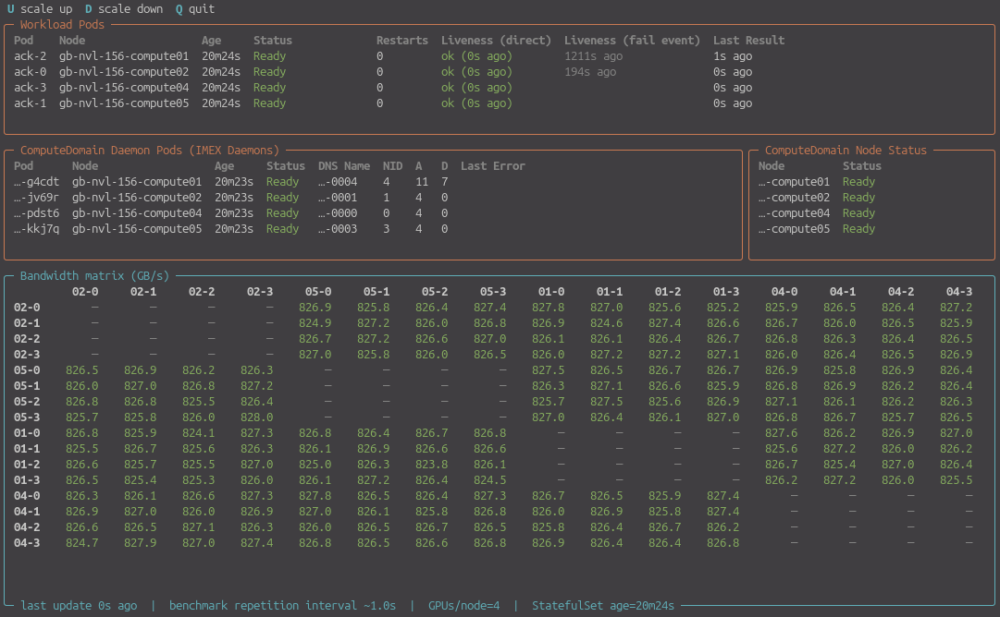

# ACK

*All-to-all CUDA memcopy test for Kubernetes.*

Tests multi-node NVLink (MNNVL) communication between GPUs. Supports adding and removing GPUs at runtime (designed as a k8s-oriented, MPI-free, dynamic alternative to [nvbandwidth](https://github.com/NVIDIA/nvbandwidth)).

Originally built to demonstrate the **elasticity** of ComputeDomains (see [NVIDIA DRA Driver for GPUs](https://github.com/NVIDIA/k8s-dra-driver-gpu)).



## CLI reference

Cleans up resources from previous runs, renders the manifest template, applies it, and waits for rollout.

```
./ack <num_pods> [options]
```

| Argument&nbsp;&nbsp;&nbsp;&nbsp;&nbsp;&nbsp;&nbsp;&nbsp;&nbsp;&nbsp;&nbsp;&nbsp;&nbsp;&nbsp;&nbsp;&nbsp;&nbsp;&nbsp;&nbsp;&nbsp;&nbsp;&nbsp;&nbsp; | Description |
|---|---|
| `num_pods` | Number of StatefulSet replicas (one pod per node). Required. |
| `--chunk-mib N` | GPU memory chunk size in MiB per transfer (default: 2500, max: 4096). |
| `--gpus-per-pod N` | GPUs per pod (default: 4). |
| `--interval-s N` | Run full benchmark (all-to-all) every N seconds (default: 1, ignored in verification mode). |
| `--gpus-via-dra` | Request GPUs via DRA instead of the device plugin. |
| `--verify N` | Verification mode (see below). |
| `--verify-timeout N` | Timeout in seconds for verification (default: 300). |
| `--teardown-on-verify-error` | Tear down resources even on verify failure (default: keep for debugging). |
| `--show-stddev` | Show bandwidth standard deviation matrix after verification succeeds. |
| `--peer-discovery M` | Peer discovery method: `k8s-api` (default) or `dns`. The K8s API is faster (no DNS propagation delay) but requires RBAC for pod listing. |


## Usage

**Continuous mode**

This is the default mode.

Pods benchmark indefinitely until terminated.
Use the dashboard (see below) to monitor pods and bandwidth results in real time.

**Verification mode (for CI/QA)**

Disable continuous mode and enable verification mode by specifying `--verify`, e.g.:

```
./ack 5 --verify 10
```

Requires N full benchmark rounds to pass consecutively.
A full round requires all `(replicas-1) × gpus_per_pod²` benchmarks to succeed.
Partial rounds are tolerated during a 120s startup phase while peers come online.
After the first full round, any non-full round is a failure.
Rounds run back-to-back (no interval delay).

Invokes `verify_wait.py` to poll all pods for results (until completion or timeout).

Upon success, prints mean and stddev bandwidth matrices and tears down the workload. Exit code 0 on success.

**Dashboard**

```
make dashboard
```

Press `U` / `D` to scale up or down.

**Simulate node replacement/failure**

```
./simulate-node-replacement.sh
./simulate-node-failure.sh
```

The first script performs a controlled cordon + drain.
The second force-kills a pod and its IMEX daemon to simulate unexpected node failure.

## Method

The application is deployed as a Kubernetes StatefulSet.
Each pod in this set runs a main loop which repeats:
1. **Discover**: get current peers
2. **Communicate**: pull memory from all remote GPUs into all local GPUs
3. **Report**: construct benchmark results

Details about allocation, transfer, measurement:

* A chunk of local GPU memory gets allocated with `cuMemCreate()`.
* The chunk is prepared for MNNVL exchange by calling `cuMemExportToShareableHandle()`.
* The resulting handle of type `CU_MEM_HANDLE_TYPE_FABRIC` is shared with a peer via HTTP.
* The peer calls `cuMemImportFromShareableHandle()` and subsequently maps memory with `cuMemMap()` (note: at this point, no memory _content_ has been communicated yet).
* The actual payload exchange is performed by `cuMemcpyDtoD()` which in this case copies remote GPU memory into local GPU memory.
* The `DtoD` operation duration is measured on-GPU via `cuEventRecord()` & `cuEventElapsedTime()`.
* Each copy is verified by running a checksum kernel.


## Components

**ack.py** — benchmark runner, runs in each StatefulSet pod.

Key concepts:

- Per-GPU HTTP-based locking ensures exclusive GPU access during measurement. Locks are acquired in consistent (pod_index, gpu_index) order to prevent deadlock, use random tokens so stale unlocks cannot release a re-acquired lock, and auto-expire via a watchdog thread to recover from crashed clients.
- A fabric handle import cache avoids the expensive import/map/setAccess path (~35-100 ms) on every benchmark. The underlying GPU memory is reallocated every 30 seconds so that the exported fabric handle bytes change regularly, exercising the full IMEX export/import path rather than relying on a single allocation from startup. Stale cache entries are evicted when handle bytes change or the peer disappears.
- A deadline-based poll loop with parallel per-peer benchmarking (one thread per peer). Peers are discovered via DNS SRV lookup on the headless Service.

**dashboard.py** — Rich TUI with four panels:

- Pods: live status of ack StatefulSet pods
- ComputeDomain daemons: status of `computedomain-daemon` pods
- ComputeDomain status: node-level CD state
- Bandwidth matrix: NVLink bandwidth (GB/s) between all GPU pairs

Per-pod polling threads fetch `/results` via node IP + hostPort. Pod and CD state comes from kubectl.

## Elasticity

The StatefulSet can be scaled up or down at any time (`make scale-up`, `make scale-down`).

**Scale-up:** new pods appear in DNS SRV records for the headless Service. Existing pods discover them on the next poll round and begin benchmarking. No coordination or restart of existing pods is needed.

**Scale-down (graceful):** when a pod receives SIGTERM, it sets a shutdown flag that immediately rejects new `/prepare-chunk` and `/lock-gpu` requests (HTTP 503). It then waits for any remotely-held local GPU locks to drain (a peer holding our lock is mid-DtoD from our memory), broadcasts `/evict-peer` to all peers so they unmap their cached imports of our fabric handles, and finally releases all local CUDA resources. This sequence ensures no peer is left holding a reference to freed GPU memory.

**Unexpected peer loss:** if a pod disappears without graceful shutdown (node failure, OOM kill, `kubectl delete --force`), its fabric handles become invalid. The IMEX daemon on surviving nodes may report `CUDA_ERROR_ILLEGAL_STATE`, which poisons the CUDA context — all subsequent CUDA API calls fail. When `cucheck()` sees this error it sets `FATAL_CUDA_ERROR`, `/healthz` starts returning 500, the kubelet liveness probe fails (failureThreshold 3 at periodSeconds 3 gives ~9 seconds to pod kill), and the pod is restarted. On restart the pod re-initializes CUDA from scratch with a clean context. If the IMEX daemon recovers before the liveness probe kills the pod, a clean round clears `FATAL_CUDA_ERROR` and the pod continues without restart.

## Deployment

A StatefulSet with ComputeDomain, headless Service, and DRA resource claims. One pod per node (enforced via `podAntiAffinity` on `kubernetes.io/hostname`), co-scheduled on the same GPU clique (via `podAffinity` on `nvidia.com/gpu.clique`). Each pod uses `hostPort: 1337`.

## Container image

The image is ~60 MB compressed (based on `ubuntu:24.04`, multi-stage build). It does not contain CUDA libraries — the checksum kernel is pre-compiled to PTX at build time, and NVRTC is not shipped.

Assumptions about the target environment:
- CUDA libraries (`libcuda.so`, etc.) are injected into the container at runtime via CDI.
- The GPU driver must be >= 580.65 (CUDA 13.0), matching the NVRTC version used at build time. The checksum kernel PTX is compiled for `compute_80` (Ampere) and is forward-compatible with newer architectures.

## Makefile targets

| Target | Description |
|---|---|
| `make build` | Build container image |
| `make build-and-push` | Build and push (tagged with git short rev) |
| `make build-and-push-as-latest` | Build and push as both rev-tagged and `latest` |
| `make dashboard` | Run the TUI dashboard via `uv run` |
| `make profile` | Record 30s CPU profile on ack-0, open in snakeviz |
| `make scale-up` / `scale-down` | Adjust StatefulSet replica count by 1 |
| `make clean` | Delete StatefulSet, Service, and ComputeDomain |

## Profiling

Each pod includes [yappi](https://github.com/sumerc/yappi) for CPU profiling, controllable via HTTP endpoints.

Start profiling (measures CPU time across all threads):

```
curl -s http://<node-ip>:1337/debug/profile-start
```

Let it run for 30+ seconds, then stop and save the result:

```
curl -s http://<node-ip>:1337/debug/profile-stop
kubectl cp ack-0:/tmp/profile.pstats ./profile.pstats
```

Inspect on the command line:

```
python3 -c "
import pstats
p = pstats.Stats('profile.pstats')
p.sort_stats('tottime').print_stats(20)
"
```

Or use [snakeviz](https://jiffyclub.github.io/snakeviz/) for an interactive browser-based flame graph:

```
pip install snakeviz
snakeviz profile.pstats
```

Or use `make profile` to automate the full workflow (start, wait 30s, stop, copy, open snakeviz).

### Live top view with py-spy

Each pod also includes [py-spy](https://github.com/benfred/py-spy) for a live `top`-like view of Python function call times:

```
kubectl exec -it ack-0 -- py-spy top --pid 1
```
